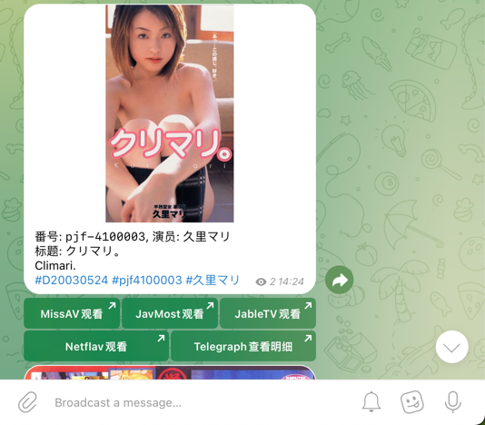
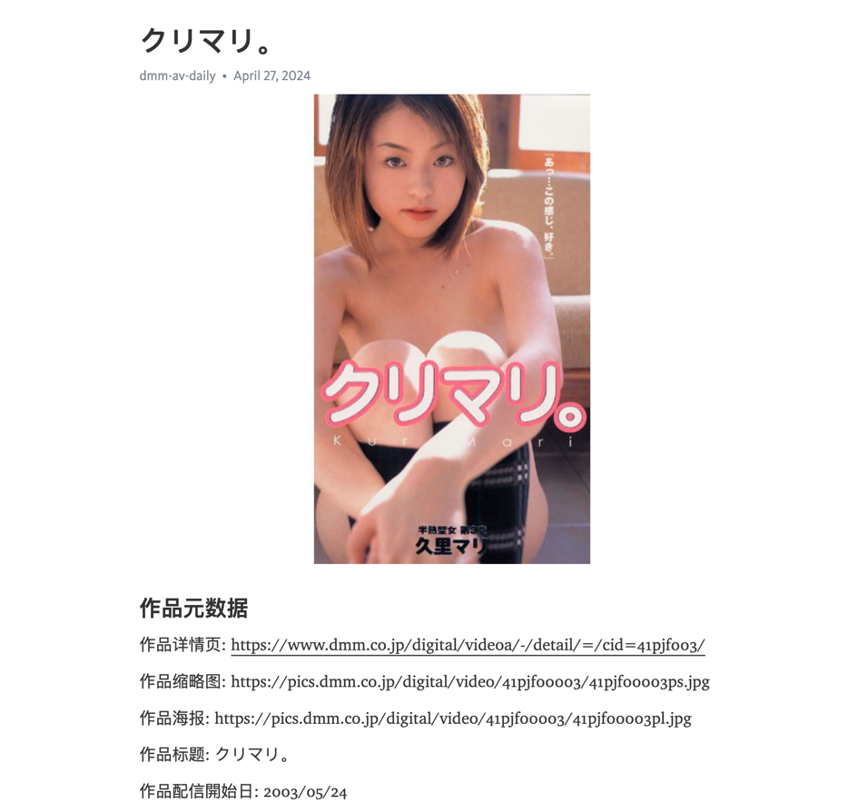

DMM AV DAILY

Get DMM AV Information daily and push it to telegram channel and store the meta data to telegraph platform.

DMM AV online sell data start from 2002-06-14

Here is the channel: [telegram channel](https://t.me/dmm_av)

Here is the post on telegraph for backing up meta data

All meta datas are stored in project data folder.

If this repo has helped you, give a star will makes me happy, thanks for watching.

License: MIT License